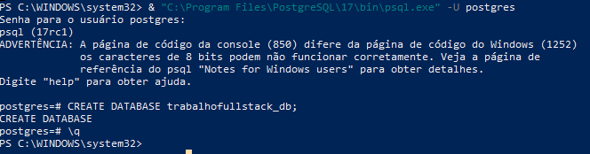
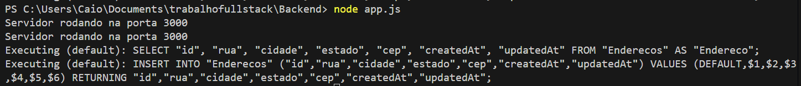

# Olá querido Professor Tiago Ravache!

- Neste repositório está o trabalho solicitado por ti no Classroom
- Preciso ressaltar que não consegui fazer o upload de uma pasta do Back-End, devido a quantidade de arquivos dela ser acima de 100;
- Tal pasta se chama **`node_modules`** e foi gerada via comando no terminal;
- Fiz os testes com o Postgres e parece que tudo está certo!

-------

# Screenshots: Comandos
- 1> Criação da database no powershell

- 2> Inicializando o servidor

